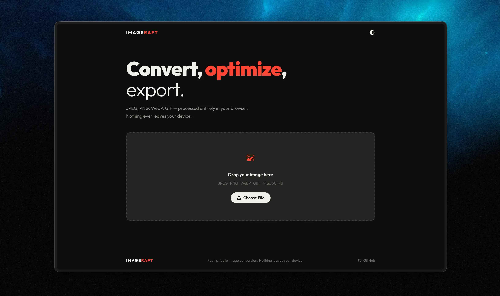

# ImageRaft

> Fast, private image converter. Convert images instantly in your browser. No uploads. No tracking. 100% private.

## Preview

## Features

- 🚀 **Blazing Fast** - Instant image conversion in your browser
- 🔒 **100% Private** - All processing happens locally, no uploads
- 📦 **Multiple Formats** - JPEG, PNG, WebP, GIF conversion
- 👁️ **Live Comparison** - Side-by-side preview with interactive slider
- 💾 **File Size Info** - See exactly how much you're saving
- 📱 **Fully Responsive** - Works on desktop, tablet, and mobile
- ♿ **Accessible** - Full keyboard navigation and screen reader support

## Quick Start

1. Visit [imageraft.vercel.app](https://imageraft.vercel.app)
2. Upload an image
3. Select your desired format and customize settings
4. Download your converted image

## Supported Formats

| Format | Use Case |
|--------|----------|
| JPEG   | High compatibility with quality control |
| PNG    | Lossless with transparency support |
| WebP   | Modern web-optimized format |
| GIF    | Animated or static images |

## Technology

- Vanilla JavaScript (no dependencies)
- HTML5 Canvas API for image processing
- 100% client-side processing
- Supports images up to 10MB

## Privacy

Your data stays yours. No file uploads, no tracking, no third-party services. All image processing happens entirely in your browser.

## License

MIT - Free to use for personal or commercial projects.

---

Made with ❤️ by [Dev Chauhan](https://github.com/devchauhann)
